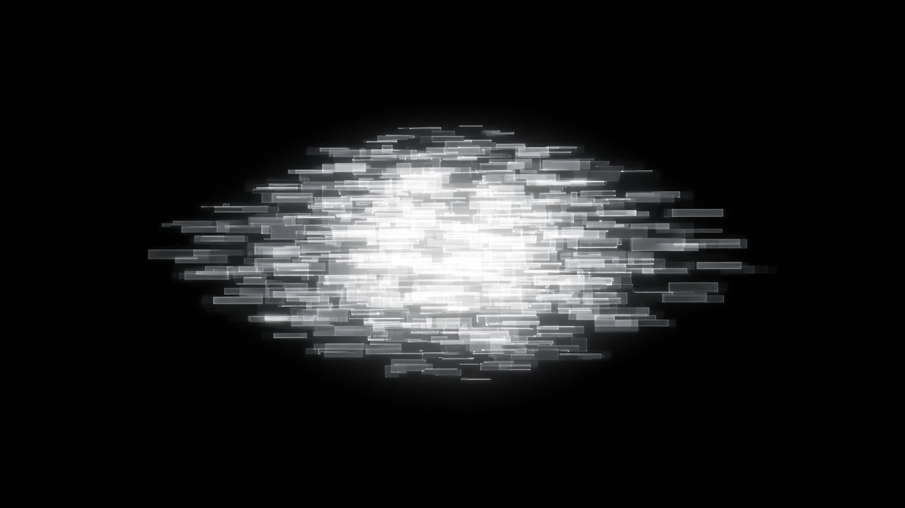
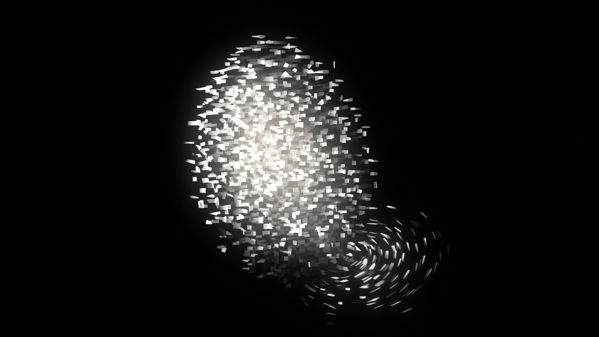

# Issue #22 · 灯光参考图与逐图验收

关联：Issue #22 / PR #23 / PRD VI-03。2026-09-15 按用户要求补充。

两张图片由用户提供，是目标气质静帧，不是已实现截图。文件从用户的 base64 附件无损解码；实际编码为 JPEG，未缩放、未重绘。

## 图 1：独处的近白碎光身体

- A1：黑底上首先读到一个完整、密集、有体积的近白光体；不能只有一小团亮核心与稀疏散点。
- A2：主体由可辨认的短矩形、薄砖与细横条构成，整体有横向叠层趋势；边缘清楚，允许少量柔光。
- A3：核心、主体、外围具有连续的密度与明暗过渡；亮核心不可替代中间层，外围细薄但仍能读出轮廓。
- A4：未成熟时无明显青色雾底；黑色负空间干净；重叠提供亮度与层次，不能糊成均匀白斑。
- A5（动态补充）：观察至少两个呼吸周期，轮廓胀缩可辨，亮度变化克制，身体保持连续。

## 图 2：轻抚时的局部形变与余韵

- B1：慢抚时主体仍是密集、近白、有核心的光体，并能沿抚摸方向伸展，不能散成零星粒子。
- B2：接触附近碎片形成可辨认的局部弯曲、转向或卷曲走向；远端反应弱于近端。图中右下卷曲是视觉参照，不要求每次固定在右下或出现完整圆环。
- B3：碎片的方向、遮叠、大小及明暗产生体积层次；避免所有碎片读成同一平面的小短线。
- B4：响应由身体碎片的位移承载，不额外绘制装饰光环；慢抚过程中保留呼吸节奏。
- B5（动态补充）：停手后局部形变连续回落，有余韵；连续抚摸无明显闪烁或电流式忙颤。

## 测试方法与判定

- 使用此 PR 的实际运行页面，记录提交编号、视口、成长状态与输入方法。
- 未成熟状态先观察独处，再缓慢横向、纵向抚摸，最后停手；保留完整画面与局部截图。
- 原图构图比例不直接规定网页光体必须占满同样面积；同时比较原始视图与身体局部，避免把缩放当作密度达标。
- 两张静帧不能证明呼吸、闪烁频率或回弹时长；A5、B4、B5 必须以动态实测为准。
- 逐项记录通过、部分达到、未达到或未验证。自动化测试通过不替代视觉验收；只有核心视觉条件均通过，才能称为达到参考图效果。
- 本次只补参考与验收，不修改渲染或业务行为；PRD 行为描述未改。
