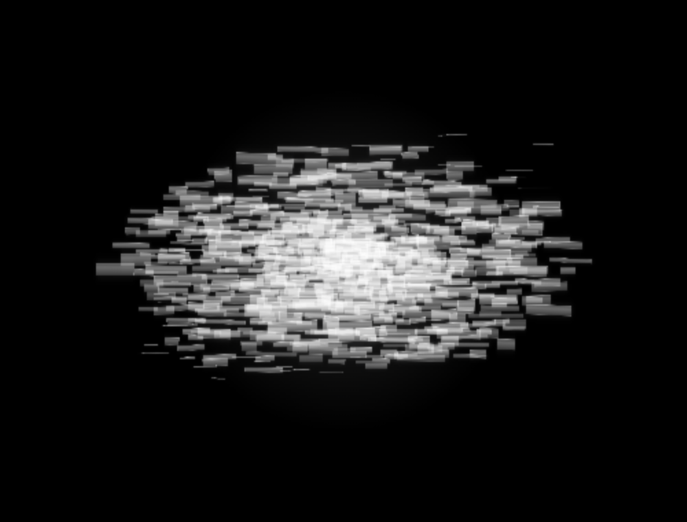
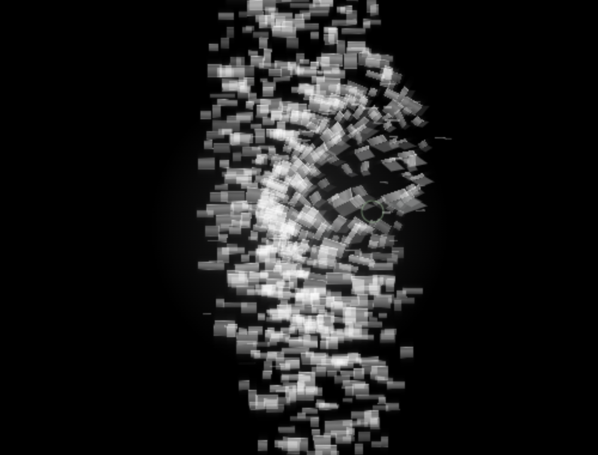

# Issue #22 / PR #23：透明薄砖与局部卷曲

本报告对应 2026-09-16 的材质重做。目标以用户两张原图的观感为准。此前 `d6fe27b`、`95300a3` 及第一次静帧微调的失败记录保留在 [历史复核](22-lighting-qa.md)，不作为本版验收结果。

## 改动与原因

旧版把“减雾、薄砖”实现成了密集的水平细线；实心矩形互相覆盖造成亮斑，随机分布又留下空洞。增加碎片数量没有解决材质与空间组织问题。

本版仍用 Canvas 2D 和同一批 720 个碎片：

- 固定分层圆盘分布覆盖核心与主体，消除随机扎堆和中间空带。
- 透明渐变宽面、细亮边与局部柔光，使用有上限的 screen 混合形成透光叠层。柔光预绘到缓存，不逐帧给每片做阴影模糊。
- 深度影响尺寸和清晰度；独处保持横向光体，抚摸后朝向连续变化。
- 抚摸时同一碎片的投影变短、变厚，局部剪切与侧面提供立体感；弯曲位置跟随实际触点，没有固定右下旋涡。
- 行为、有效抚摸、受惊、疲倦、成长档案格式不变；不添加装饰粒子或光环。

## 图 1：独处

[原图 1](references/lighting/reference-1.jpg)

- A1 / A3：实际页面有完整密集的光体，核心—主体—外围连续。旧版亮核与空中间层已经消除。
- A2：主体能读出透明宽面与薄砖叠层，外围保留细条。
- A4：初生近白，无青雾；核心由透光重叠构成，不再靠实心白块覆盖。局部高亮仍存在，与参考图一样并非所有碎片同亮度。
- A5：连续录制包含超过 12 秒的模型独处时间，呼吸周期约 5.5 秒；轮廓与层间距持续变化，无随机显隐。

## 图 2：慢抚

[原图 2](references/lighting/reference-2.jpg)

- B1 / B3：主体保留同一批碎片，慢抚时变成短厚碎片，能看到不同方向、侧面与遮叠。
- B2：弧线慢抚实际触发局部卷曲；位置来自触点，不照搬原图右下的构图。
- B4：横向和纵向实际鼠标输入分别触发对应方向伸展；沿用原有涟漪、扰动、伸展信号。
- B5：停手后扰动、伸展和涟漪都衰减至 0。快速扫过触发受惊，并录制后续恢复。具体状态与截图同步保存在 [浏览器记录](references/lighting/qa/browser-results.json)。

这是一版对参考视觉特征的程序化实现，不是把原图当纹理贴入页面；不宣称与原图逐像素相同。图 2 的局部卷曲随输入而变，整幅姿态不会固定成原图构图。

## 证据方式与边界

- 真实页面 `http://localhost:3022/`，新建隔离浏览器会话，初生 0% 开始；未修改用户浏览器中的成长存档。
- 通过正常指针事件慢抚，未直接写入 FX 强度。画面与应用只读状态在同一帧抓取，避免停鼠标再截图导致形变消退。
- 局部图是实际画布的 500×380 区域放大至 1000×760，方便比较形态；放大不增加实际分辨率。完整画布也保留为同名不带 `-detail` 的 PNG。
- 窄屏、1080p、成熟与纯画面另留截图；成熟是隔离会话加载满成长档案。休息状态的几何合法性由自动化状态测试覆盖，不伪称已用鼠标完成整段疲倦触发过程。
- 录像是实际 Canvas 流，不含操作系统桌面，未控制用户鼠标。

## 性能

同机后台 Chrome，不录屏，直接运行真实模型与渲染器；每种条件预热 20 帧、记录 80 帧。测量的是 `draw` 的调用耗时，不包含完整显示管线，不承诺所有设备稳定 60 FPS。

- 1280×720 / DPR 1：旧版中位数 23.8 ms，新版 13.1 ms；新版 P95 18.5 ms。
- 1920×1080 / DPR 1：旧版 22.3 ms，新版 15.3 ms；新版 P95 23.8 ms。
- 599×498 / DPR 1：旧版 21.8 ms，新版 13.5 ms；新版 P95 19.2 ms。
- 1280×720 / DPR 2：旧版 27.0 ms，新版 18.0 ms；新版 P95 39.0 ms，高像素密度仍有帧耗时波动。

[原始性能记录](references/lighting/qa/performance.json)。基线为 `95300a3`。录屏下的 callback 耗时包含录制竞争，不与此组直接混用。

## 复现

最终应用代码检查：`npm test` 28/28，`npm run typecheck`、`npm run lint`、`npm run build` 均通过；[退出码记录](references/lighting/qa/checks.json)。新增测试覆盖材质缓存复用与成长换色时重建，原有行为断言保留。

启动开发服务器后，使用已安装的 Playwright 执行 `node scripts/lighting-browser-qa.mjs`。如使用外部运行时，设置 `PLAYWRIGHT_MODULE` 为其模块绝对路径；可用 `QA_URL` 指定页面。`node scripts/lighting-benchmark.mjs` 复现上述前后渲染耗时比较。

本次继续更新同一分支和 PR；未合并、未发布。
