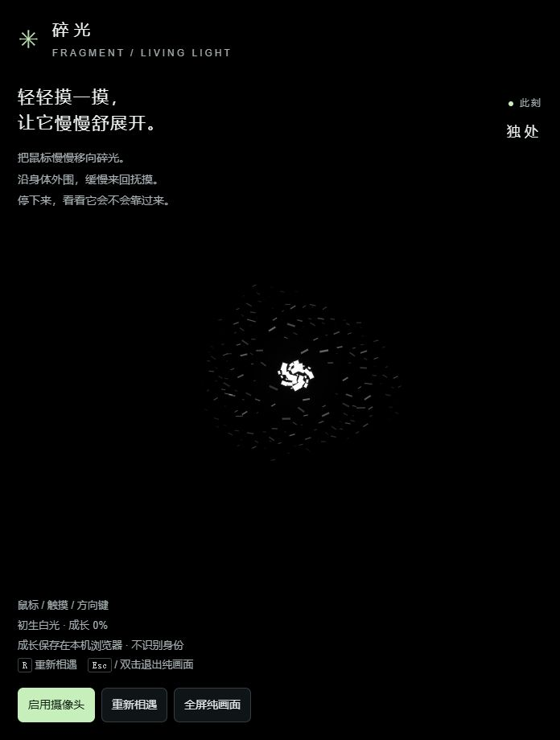
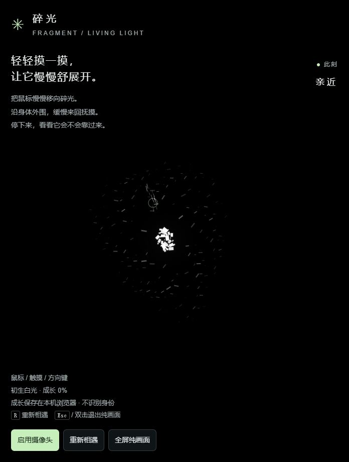
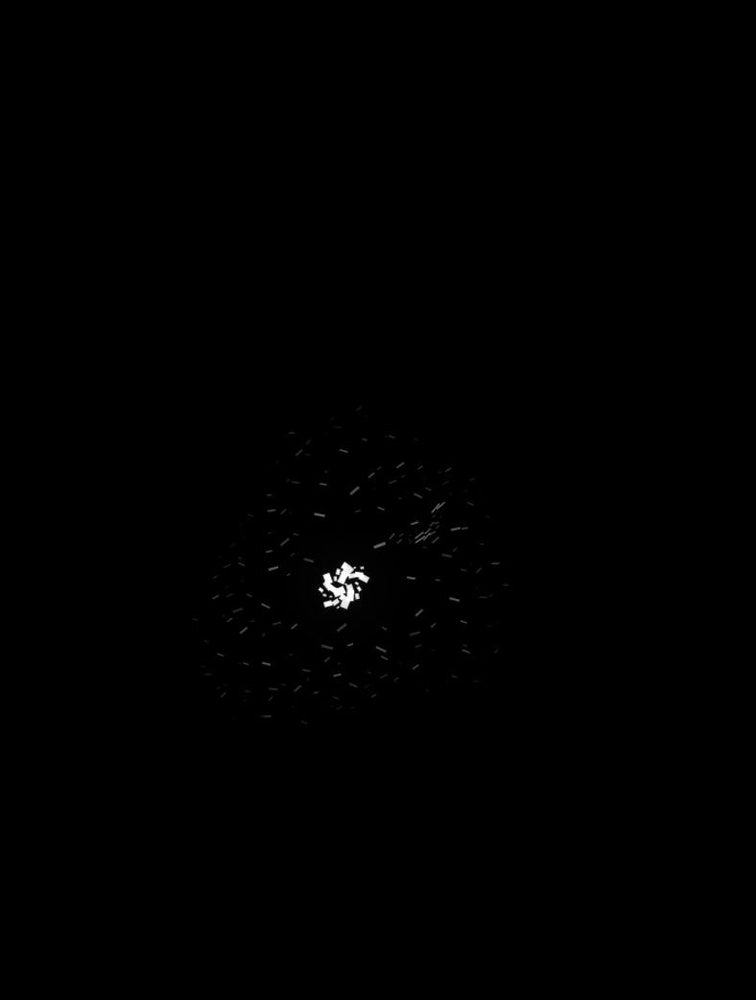
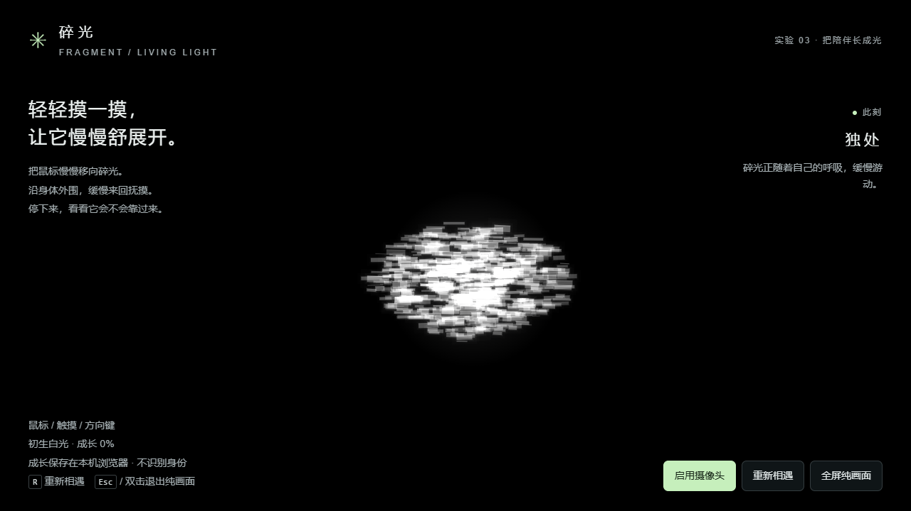
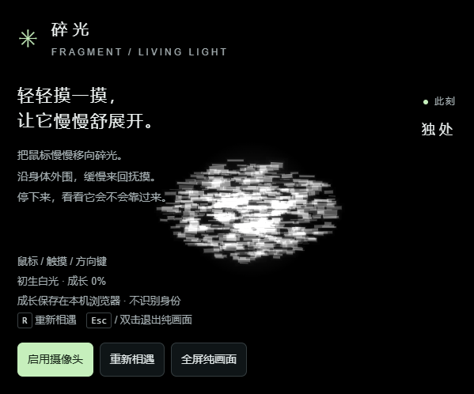

# Issue #22 / PR #23 · 参考图效果复核

> 本页保留历史失败与中间版本记录。2026-09-16 透明材质重做的当前结果见 [最新逐图报告](22-lighting-final-review.md)。

## 结论：未达到参考图效果

测试版本 `6f95eeb`，渲染与行为代码等同 `d6fe27b`。测试在本机 `http://localhost:3022/` 的实际应用页面进行，初生白光、成长显示 0%。输入为鼠标点击定位及方向键往返，包含独处、靠近、邀约、亲近、纯画面与退出纯画面。窗口模式截图 687×928，纯画面截图 800×1036；不把构图占比直接当作验收要求。

## 图 1

- A1 未达到：小块高亮核心与稀疏暗短线明显分离，没有密集完整的光体。
- A2 部分达到：有矩形和细短线，但缺少参考图的密集横向叠层。
- A3 未达到：中间层空，核心到外围的视觉过渡不足。
- A4 部分达到：近白、无明显青雾、黑底干净；叠加的丰富层次不足。
- A5 未充分验证：分时截图可见身体位置及轮廓变化，但本次未录制覆盖两个完整呼吸周期的连续证据，不将其判为通过。

## 图 2

- B1 未达到：触发亲近后仍是稀疏身体，不具备参考图的密集光体；方向伸展的视觉强度未充分验证。
- B2 未充分验证：本次截图没有展示清楚的局部卷曲走向；不能凭分时截图认定该动态不存在或已经通过。
- B3 未达到：碎片主要读成平面小短线，遮叠及体积层次不足。
- B4 部分达到：纯画面干净，没有看到额外装饰光环；慢抚与呼吸的动态关系未充分验证。
- B5 未充分验证：本次未保留连续视频，不对回弹时长、频闪或微颤作通过判断。

亲近状态读数曾为 `phase=bond`、`touchZone=body`、`enjoyment=0.324`、`care=0.28`，确认曾触发有效互动。采样时 `ripples/disturb/stretch` 已为 0，不能用该读数证明瞬时 FX 画面达标。

## 代码与自动化

- `npm test`：本轮任务实际运行，24/24 通过。
- `npm run typecheck`：本轮任务实际运行，通过。
- `npm run lint`：本轮任务实际运行，失败；`tests/creature.test.ts` 有 12 处既有 `no-floating-promises` 报错。
- `npm run build`：本轮未运行；旧 PR 的 build 通过记录不当作本轮结果。
- 历史版本 `d6fe27b` 保留 210 个碎片、28 个核心碎片，外围尺寸与透明度进一步下降，造成“减雾后更显稀疏”。本轮已改为 720 个固定种子碎片和分层绘制，旧版失败结论不代表当前实现。

本轮只补充原图、验收标准与测试证据，未修改应用行为，未合并或部署。建议继续打磨中间层密度、薄砖尺寸与方向、遮叠和局部形变后，重新录制连续视频逐项验收。
# 2026-09-16 静帧修订（未验收）

关联 Issue #22 / PR #23。用户提供的窄屏截图显示：主体像水平扫描线，缺少薄砖宽面、前后层次和局部透光感。上一版参数与自动化通过不构成视觉通过。

本轮先调整独处画面：加厚主体碎片、扩大长短变化、拉开深度对应的尺寸差异、略微横向舒展分布，并在碎片附近绘制低强度局部亮边。没有修改成长档案或有效抚摸规则。VI-03 继续保持开发中；动态卷曲和原图一致性尚不判定通过。

实际浏览器静帧：Chrome 后台新会话，localhost:3022，成长 0%，独处；1280×720 与 599×498。首轮截图过早，仅有界面，已等待客户端渲染后重拍。发现独处朝向把横向身体转为竖条，因此将主体朝向响应限制在抚摸时，探索碎片仍跟随注意方向。

静帧评估：薄砖宽面与横向轮廓改善；原图中的透光层次仍未完全达到，中心部分重叠偏白，窄屏与说明文字接近。此轮没有开展全功能和动态验收，不能将上述截图作为图 2 卷曲通过的证据。

本轮最终代码自动化：`npm test` 27/27；`npm run typecheck`、`npm run lint` 通过。实际浏览器截图只能证明本节所述静态变化。
